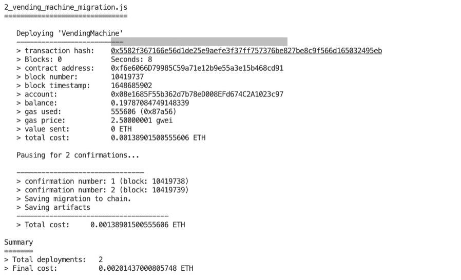

# Vending Machine Smart Contract
Smart contract project to learn how to test & deploy a smart contract to Ethereum using Truffle.

#### By Karen Axon

<p align="left">

</p>
<p align="left">

</p>


## Technologies Used
* Javascript
* Solidity
* Truffle
* Rinkeby


## Setup/Installation 

* Install [Truffle](https://trufflesuite.com/)
* Follow [tutorial](https://www.youtube.com/watch?v=YYJgeV7sOvM&list=PLD_RqipW0-9usElaE6DZEkMpzUM2HJv2v&index=6)
* Set up an .env file with the following:
  
  ```
    PRIVATE_KEY_1=yourFirstAccountNumber
    PRIVATE_KEY_2=yourSecondAccountNumber
    PASS_KEY=theAccountMnemonic/PrivateKeys
  ```


## Known Bugs
* None


## License

[MIT](https://choosealicense.com/licenses/mit/)

Copyright (c) January 2022 - Karen Axon


## Contact Information:

<h3>Karen Axon</h3>

[](https://github.com/karenaxon)
[](https://www.linkedin.com/in/kaxon)
